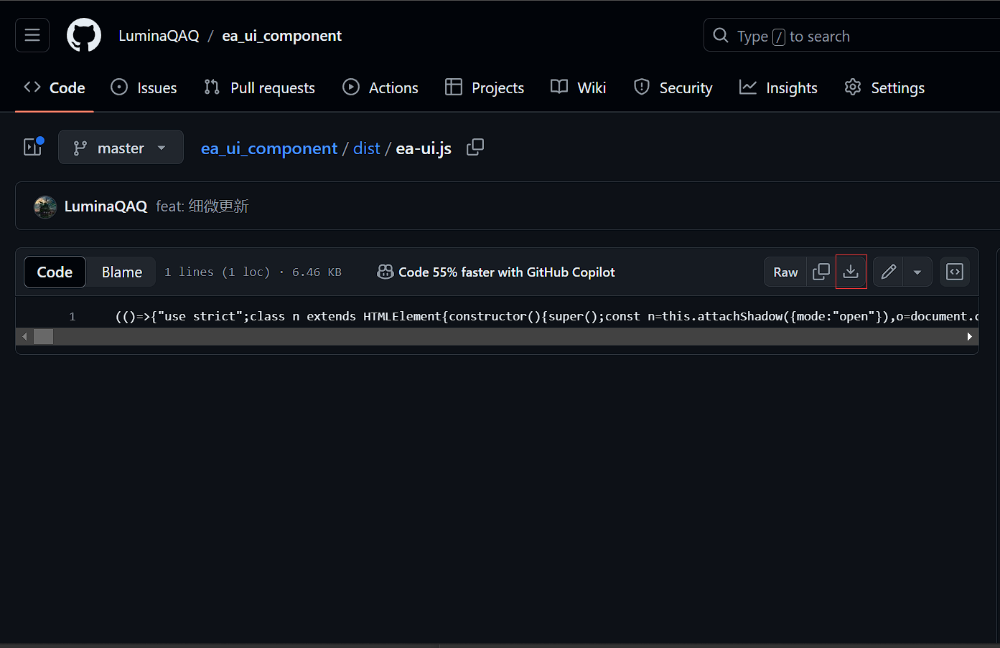

# 安装

## 1. 从 github [下载](https://github.com/LuminaQAQ/ea_ui_component/blob/master/dist/ea-ui.js)

## 2. 跳转到源码页面手动保存

---

<a href="https://luminaqaq.github.io/ea_ui_component/assets/chunks/index.Dbei1mnz.js" download>ea-ui.js</a>

---

<a href="https://luminaqaq.github.io/ea_ui_component/icon/css/animation.css" download >animation.css</a>

---

<a href="https://luminaqaq.github.io/ea_ui_component/icon/css/fontello.css" download>fontello.css</a>
